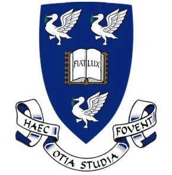
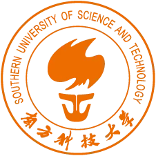

  

<section class="about-section about-section--intro">
  <h1></h1>

  

  

    
    
    
    
  

  

    <section class="about-glance__story">
      
      <h2 class="about-glance__title"></h2>
      


    </section>
    

      <article class="about-stat">
        

          MRes
          

            
            
          

        

        UoL x ZJU
        
      </article>
      <article class="about-stat">
        

          BEng
          

            
          

        

        SUSTech
        
      </article>
      <article class="about-stat">
        

          
        

        Jabbr · OMOway · Boundary AI
        
      </article>
    

  

  

    <article class="about-panel">
      
      <h3 class="about-panel__title"></h3>
      
My work is not limited to a single perception niche. I have built tactile sensing systems, multi-sensor fusion pipelines, SLAM components, and data-generation workflows for autonomous-driving scenarios, which gives me a broad but coherent understanding of perception systems.

      
我的工作并不局限于某一个细分感知方向，而是横跨触觉感知系统、多传感器融合流程、SLAM 组件以及自动驾驶场景的数据生成方法。这让我对感知系统形成了更完整且连贯的理解。

    </article>

    <article class="about-panel">
      
      <h3 class="about-panel__title"></h3>
      
My publication record ranges from tactile sensing in <em>ACS Nano</em> and <em>Nature Communications</em> to multi-sensor USV tracking in <em>Ocean Engineering</em> and large-scale novel-view synthesis accepted to <em>IROS</em>. Across topics, the common thread is building methods that matter at the system level rather than optimizing in isolation.

      
我的论文工作从 <em>ACS Nano</em> 与 <em>Nature Communications</em> 的触觉感知，延伸到 <em>Ocean Engineering</em> 的多传感器无人艇跟踪，以及被 <em>IROS</em> 接收的大规模新视角图像合成。不同题目背后的共同主线，是关注真正影响系统表现的方法，而不是脱离场景的局部优化。

    </article>

    <article class="about-panel">
      
      <h3 class="about-panel__title"></h3>
      
Beyond academic labs, I have worked on V-SLAM and AI systems in startup and product environments, and spent a period engaging with more than 100 startups as an AI industry analyst. That combination makes me attentive not only to technical quality, but also to timing, scope, and product usefulness.

      
除了学术实验室，我也在创业与产品环境中做过 V-SLAM 和 AI 系统，还曾以 AI 产业分析师身份深度接触 100 余家创业公司。这种组合让我在关注技术质量之外，也会同时考虑节奏、边界与产品价值。

    </article>

    <article class="about-panel about-panel--accent">
      
      <h3 class="about-panel__title"></h3>
      
In several projects I took ownership of illustrations, videos, and presentation materials in addition to algorithms and experiments. Outside work, photography and visual storytelling continue to sharpen how I explain systems. Some of that work is <a href="https://unsplash.com/@billyxue">here</a>.

      
在不少项目里，我除了负责算法与实验，也主动承担插图、视频和展示材料的制作。工作之外，摄影与视觉叙事也持续影响我解释技术系统的方式。部分作品可以在<a href="https://unsplash.com/@billyxue">这里</a>看到。

    </article>
  

</section>

<section class="about-section">
  <h2></h2>

  


</section>

<h2></h2>

<section class="about-news" data-news-stack aria-label="News timeline" data-i18n-aria-label-en="News timeline" data-i18n-aria-label-zh="动态时间线">
  

    <article class="about-news__item about-news__item--move" data-news-card role="listitem">
      

      

        

          2025-09
          
        

        


      

    </article>

    <article class="about-news__item about-news__item--paper" data-news-card role="listitem">
      

      

        

          2025-06
          
        

        


      

    </article>

    <article class="about-news__item about-news__item--pivot" data-news-card role="listitem">
      

      

        

          2025-04
          
        

        


      

    </article>

    <article class="about-news__item about-news__item--offer" data-news-card role="listitem">
      

      

        

          2025-03
          
        

        


      

    </article>

    <article class="about-news__item about-news__item--move" data-news-card role="listitem">
      

      

        

          2024-12
          
        

        


      

    </article>

    <article class="about-news__item about-news__item--pivot" data-news-card role="listitem">
      

      

        

          2024-11
          
        

        


      

    </article>

    <article class="about-news__item about-news__item--paper" data-news-card role="listitem">
      

      

        

          2024-05
          
        

        


      

    </article>

    <article class="about-news__item about-news__item--offer" data-news-card role="listitem">
      

      

        

          2024-04
          
        

        


      

    </article>

    <article class="about-news__item about-news__item--move" data-news-card role="listitem">
      

      

        

          2024-03
          
        

        


      

    </article>

    <article class="about-news__item about-news__item--award" data-news-card role="listitem">
      

      

        

          2024-02
          
        

        


      

    </article>

    <article class="about-news__item about-news__item--paper" data-news-card role="listitem">
      

      

        

          2023-11
          
        

        


      

    </article>
  

</section>

---

  

