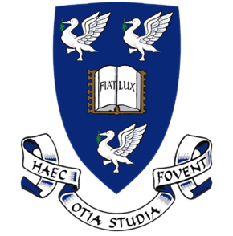

  

<h2></h2>



  
  
  
  

  <section class="about-glance__story">
    
    <h2 class="about-glance__title"></h2>
    


  </section>
  

    <article class="about-stat">
      

        MRes
        

          
          
        

      

      UoL x ZJU
      
    </article>
    <article class="about-stat">
      

        BEng
        

          
        

      

      SUSTech
      
    </article>
    <article class="about-stat">
      
      
      
    </article>
  

I work at the intersection of robotics perception, computer vision, and applied machine learning, with a focus on systems that can move from research prototypes into deployable products. I received an M.Res. with Distinction in Pattern Recognition and Intelligent Systems from the [University of Liverpool](https://www.liverpool.ac.uk), supported by the [Huzhou Institute of Zhejiang University](http://hzi.zju.edu.cn/site/main), and a B.Eng. in Computer Science and Technology from [Southern University of Science and Technology (SUSTech)](https://www.sustech.edu.cn/en).

My experience spans academic labs, startup engineering, and industry-facing technical development. Over several years of research and product work, I have built algorithms, prototype systems, and collaboration habits that translate well across research, engineering, and commercialization contexts. A later period exploring frontier-technology investing broadened how I think about technical ambition, product timing, and the path from idea to market.

我的工作位于机器人感知、计算机视觉与应用机器学习的交叉地带，重点关注那些能够从研究原型走向真实部署的系统。我在[利物浦大学](https://www.liverpool.ac.uk)获得模式识别与智能系统方向 M.Res. 学位并以 Distinction 毕业，期间受[浙江大学湖州研究院](http://hzi.zju.edu.cn/site/main)资助；此前在[南方科技大学（SUSTech）](https://www.sustech.edu.cn/en)获得计算机科学与技术专业工学学士学位。

我的经历覆盖学术实验室、创业型工程团队与面向产业的技术开发。在多年的研究与产品实践中，我逐步形成了能够跨越研究、工程与商业化场景的方法论，既能做算法，也能推进原型系统与跨团队协作。后来一段面向前沿科技投资的经历，又进一步拓展了我对技术雄心、产品时机以及从想法走向市场路径的理解。

<h2></h2>

My core interests are machine learning, pattern recognition, robotics perception, and computer vision. Outside work, I spend time on photography, hiking, football, and visual storytelling. You can find some of my photos and illustrations [here](https://unsplash.com/@billyxue).

If you are building something ambitious in robotics or perception, I would be glad to connect.

我当前的核心兴趣聚焦于机器学习、模式识别、机器人感知与计算机视觉。工作之外，我也持续投入在摄影、徒步、足球以及视觉叙事上。部分照片和插画作品可以在[这里](https://unsplash.com/@billyxue)看到。

如果你正在做有野心的机器人或感知相关项目，欢迎联系我。

<h2></h2>

<ul class="profile-updates">
  <li></li>
  <li></li>
  <li></li>
  <li></li>
  <li></li>
  <li></li>
  <li></li>
  <li></li>
  <li></li>
</ul>

---

  


  

    
  

  

    
    

      <button type="button" class="font-preview-panel__option is-active" data-font-preset="default"></button>
      <button type="button" class="font-preview-panel__option" data-font-preset="system-sans"></button>
      <button type="button" class="font-preview-panel__option" data-font-preset="editorial"></button>
      <button type="button" class="font-preview-panel__option" data-font-preset="scholar"></button>
      <button type="button" class="font-preview-panel__option" data-font-preset="studio"></button>
    

  

  

    
    

      <button type="button" class="font-preview-panel__option is-active" data-density-preset="balanced"></button>
      <button type="button" class="font-preview-panel__option" data-density-preset="compact"></button>
      <button type="button" class="font-preview-panel__option" data-density-preset="relaxed"></button>
    

  

