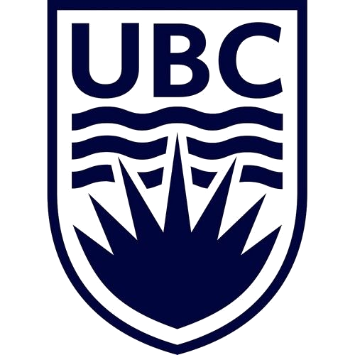



  <a class="btn btn--primary" href="https://drive.google.com/file/d/1tV_HWoPmH-wsyAeUMnmPxYyeKQkzrKXr/preview" target="_blank" rel="noopener">Resume (EN)</a>
  <a class="btn btn--inverse" href="https://drive.google.com/file/d/1E2BlLuXIvtUrV_0oL_njYSsOqR9UlG1u/preview" target="_blank" rel="noopener">简历（中文）</a>

<section id="education" class="cv-section">
  

    <header class="cv-section__header">
      <h2>Education</h2>
    </header>

    

      <article class="cv-entry">
        

          

            

              <h3>Master of Research</h3>
              

                
                
              

            

            2022.9 - 2024.4
          

          
University of Liverpool (UoL) / XJTLU, Liverpool, UK / Suzhou, China

        

        
Pattern Recognition and Intelligent Systems · Distinction · Best Overall Award

        <ul class="cv-entry__list">
          <li>School of Advanced Technology, fully funded by Zhejiang University.</li>
          <li>Dissertation: <em>Research of 3D Perception Algorithm Based on Multi-Sensor Fusion</em> <a href="{{ base_path }}/projects/2024-master.html">[Details]</a></li>
        </ul>
      </article>

      <article class="cv-entry">
        

          

            

              <h3>Bachelor of Engineering</h3>
              

                
              

            

            2015.9 - 2019.7
          

          
Southern University of Science and Technology (SUSTech), Shenzhen, China

        

        
Computer Science and Technology

        <ul class="cv-entry__list">
          <li><a href="https://cse.sustech.edu.cn/en">Department of Computer Science and Engineering</a>.</li>
          <li>Dissertation: <em>Real-time 3D Human Skeleton Reconstruction Based on RGB Camera Array</em> <a href="{{ base_path }}/projects/2019-bachelor.html">[Details]</a></li>
          <li>2nd Place in Capstone Design Competition at the College of Engineering.</li>
          <li>Outstanding Undergraduate Dissertation 2019.</li>
        </ul>
      </article>

      <article class="cv-entry">
        

          

            

              <h3>Summer Program</h3>
              

                
              

            

            2017.6 - 2017.9
          

          
The University of British Columbia (UBC), Vancouver, Canada

        

        
Department of ECE

        <ul class="cv-entry__list">
          <li>Excellent Student in Summer Program.</li>
        </ul>
      </article>
    

  

  

    <header class="cv-section__header">
      <h2>教育背景</h2>
    </header>

    

      <article class="cv-entry">
        

          

            

              <h3>研究型硕士</h3>
              

                
                
              

            

            2022.9 - 2024.4
          

          
利物浦大学（UoL） / 西交利物浦大学，英国利物浦 / 中国苏州

        

        
模式识别与智能系统 · Distinction · Best Overall Award

        <ul class="cv-entry__list">
          <li>智能工程学院，由浙江大学提供全额资助。</li>
          <li>学位论文：<em>基于多传感器融合的三维感知算法研究</em> <a href="{{ base_path }}/projects/2024-master.html">[项目详情]</a></li>
        </ul>
      </article>

      <article class="cv-entry">
        

          

            

              <h3>工学学士</h3>
              

                
              

            

            2015.9 - 2019.7
          

          
南方科技大学（SUSTech），中国深圳

        

        
计算机科学与技术

        <ul class="cv-entry__list">
          <li><a href="https://cse.sustech.edu.cn/en">计算机科学与工程系</a>。</li>
          <li>毕业设计：<em>基于 RGB 相机阵列的实时三维人体骨架重建</em> <a href="{{ base_path }}/projects/2019-bachelor.html">[项目详情]</a></li>
          <li>工学院综合设计竞赛二等奖。</li>
          <li>2019 届优秀本科毕业论文。</li>
        </ul>
      </article>

      <article class="cv-entry">
        

          

            

              <h3>短期交流</h3>
              

                
              

            

            2017.6 - 2017.9
          

          
不列颠哥伦比亚大学（UBC），加拿大温哥华

        

        
ECE 暑期项目

        <ul class="cv-entry__list">
          <li>获评暑期项目优秀学员。</li>
        </ul>
      </article>
    

  

</section>

<section id="experience" class="cv-section">
  

    <header class="cv-section__header">
      <h2>Experience</h2>
    </header>

    

      <article class="cv-entry">
        

          

            

              <h3><a href="https://jabbr.ai/">Jabbr</a></h3>
            

            2025.9 - present
          

          
AI Algorithm Engineer

        

      </article>

      <article class="cv-entry">
        

          

            

              <h3><a href="https://www.omoway.com/">OMOway</a></h3>
            

            2024.12 - 2025.08
          

          
V-SLAM Algorithm Engineer

        

        <ul class="cv-entry__list">
          <li>Autonomy perception for the company’s first product.</li>
          <li>Visual localization, odometry, and static / dynamic map construction.</li>
        </ul>
      </article>

      <article class="cv-entry">
        

          

            

              <h3><a href="http://www.dingxin-capital.com">Dingxin Capital</a></h3>
            

            2024.6 - 2024.11
          

          
AI Industry Analyst

        

        <ul class="cv-entry__list">
          <li>Covered more than 100 AI startups.</li>
          <li>Research focus: fundraising, operations, and product positioning.</li>
        </ul>
      </article>

      <article class="cv-entry">
        

          

            

              <h3><a href="https://www.boundaryai.cn/en">Boundary.AI</a></h3>
            

            2024.3 - 2024.6
          

          
V-SLAM Algorithm Engineer

        

        <ul class="cv-entry__list">
          <li>V-SLAM system development.</li>
        </ul>
      </article>

      <article class="cv-entry">
        

          

            

              <h3><a href="http://hzi.zju.edu.cn">Huzhou Institute of Zhejiang University</a></h3>
            

            2022.9 - 2024.3
          

          
Perception Algorithm Engineer Intern, <a href="https://april.zju.edu.cn">APRIL Lab</a>

        

      </article>

      <article class="cv-entry">
        

          

            

              <h3><a href="https://www.xjtlu.edu.cn/en">Xi’an Jiaotong-Liverpool University</a></h3>
            

            2022.9 - 2024.3
          

          
Teaching Assistant

        

        <ul class="cv-entry__list">
          <li>DTS201TC Pattern Recognition (130+ undergraduate students).</li>
          <li>DTS206TC Applied Linear Statistical Models (130+ undergraduate students).</li>
        </ul>
      </article>

      <article class="cv-entry">
        

          

            

              <h3><a href="https://www.sustech.edu.cn/en/">Southern University of Science and Technology</a></h3>
            

            2019.9 - 2022.8
          

          
Research and Teaching Assistant, <a href="https://github.com/sustech-isus">ISUS Lab</a>

        

        <ul class="cv-entry__list">
          <li>Supported CS401 Intelligent Robotics and CS405 Machine Learning.</li>
          <li>Concurrent Computer Vision Engineer at Roboeye Technology during 2019.9 - 2021.8.</li>
          <li>Led an applied research project extending the undergraduate dissertation and capstone project.</li>
        </ul>
      </article>
    

  

  

    <header class="cv-section__header">
      <h2>工作经历</h2>
    </header>

    

      <article class="cv-entry">
        

          

            

              <h3><a href="https://jabbr.ai/">Jabbr</a></h3>
            

            2025.9 - 至今
          

          
AI 算法工程师

        

      </article>

      <article class="cv-entry">
        

          

            

              <h3><a href="https://www.omoway.com/">目蔚科技</a></h3>
            

            2024.12 - 2025.08
          

          
V-SLAM 算法工程师

        

        <ul class="cv-entry__list">
          <li>公司首款产品的自动驾驶感知算法开发。</li>
          <li>视觉定位、里程计与静态 / 动态地图构建。</li>
        </ul>
      </article>

      <article class="cv-entry">
        

          

            

              <h3><a href="http://www.dingxin-capital.com">鼎心资本</a></h3>
            

            2024.6 - 2024.11
          

          
AI 产业分析师

        

        <ul class="cv-entry__list">
          <li>覆盖 100 余家 AI 创业公司。</li>
          <li>研究方向：融资、运营与产品定位。</li>
        </ul>
      </article>

      <article class="cv-entry">
        

          

            

              <h3><a href="https://www.boundaryai.cn/en">Boundary.AI</a></h3>
            

            2024.3 - 2024.6
          

          
V-SLAM 算法工程师

        

        <ul class="cv-entry__list">
          <li>V-SLAM 系统研发。</li>
        </ul>
      </article>

      <article class="cv-entry">
        

          

            

              <h3><a href="http://hzi.zju.edu.cn">浙江大学湖州研究院</a></h3>
            

            2022.9 - 2024.3
          

          
<a href="https://april.zju.edu.cn">APRIL Lab</a> 感知算法工程师（实习）

        

      </article>

      <article class="cv-entry">
        

          

            

              <h3><a href="https://www.xjtlu.edu.cn/en">西交利物浦大学</a></h3>
            

            2022.9 - 2024.3
          

          
助教

        

        <ul class="cv-entry__list">
          <li>DTS201TC 模式识别（130+ 本科生）。</li>
          <li>DTS206TC 应用线性统计模型（130+ 本科生）。</li>
        </ul>
      </article>

      <article class="cv-entry">
        

          

            

              <h3><a href="https://www.sustech.edu.cn/en/">南方科技大学</a></h3>
            

            2019.9 - 2022.8
          

          
<a href="https://github.com/sustech-isus">ISUS Lab</a> 科研与教学助理

        

        <ul class="cv-entry__list">
          <li>参与 CS401 智能机器人与 CS405 机器学习课程教学支持。</li>
          <li>2019.9 - 2021.8 同时兼任械瞳科技计算机视觉工程师。</li>
          <li>主导一项延续本科毕业设计与综合设计项目的应用研究。</li>
        </ul>
      </article>
    

  

</section>

<section id="skills" class="cv-section">
  

    <header class="cv-section__header">
      <h2>Skills & Interests</h2>
    </header>

    

      <article class="cv-skill-card">
        <h3>Languages</h3>
        
Python &gt; Matlab &gt; C++ = Java &gt; R

      </article>
      <article class="cv-skill-card">
        <h3>Areas</h3>
        
Robotics perception, computer vision, multi-sensor fusion, V-SLAM, and applied machine learning.

      </article>
      <article class="cv-skill-card">
        <h3>Media & Presentation</h3>
        
Photography, video editing, illustration, technical slides, figures, and demos.

      </article>
      <article class="cv-skill-card">
        <h3>Interests</h3>
        
Football, badminton, table tennis, hiking, and visual storytelling.

      </article>
    

  

  

    <header class="cv-section__header">
      <h2>技能与兴趣</h2>
    </header>

    

      <article class="cv-skill-card">
        <h3>编程语言</h3>
        
Python &gt; Matlab &gt; C++ = Java &gt; R

      </article>
      <article class="cv-skill-card">
        <h3>应用方向</h3>
        
机器人感知、计算机视觉、多传感器融合、V-SLAM 与应用机器学习。

      </article>
      <article class="cv-skill-card">
        <h3>影像与展示</h3>
        
摄影、视频剪辑、插画、技术汇报、论文配图与演示材料制作。

      </article>
      <article class="cv-skill-card">
        <h3>兴趣</h3>
        
足球、羽毛球、乒乓球、徒步与视觉叙事。

      </article>
    

  

</section>

<section id="publications" class="cv-section">
  <header class="cv-section__header">
    <h2></h2>
  </header>

  

    

      <ol class="archive cv-ordered">
        
          
        
      </ol>
    

  

</section>
