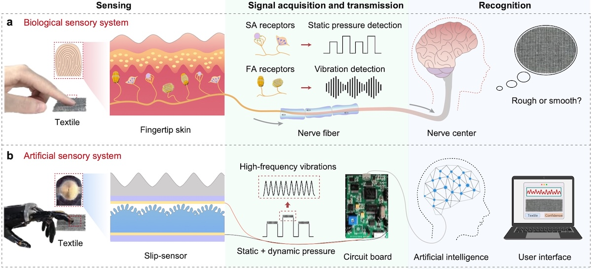

<figure class="publication-figure">
  
  <figcaption>
    <strong>Figure.</strong> A robotic sensory system mimicking the human sensory system for texture recognition. a) 
The biological sensory system of humans. b) The arti system of this study, for which the sensor can detect both 
static and dynamic pressures.
  </figcaption>
</figure>

<h3 class="publication-section-heading">Abstract</h3>
Humans can gently slide a finger on the surface of an object and identify it by capturing both static pressure and 
high-frequency vibrations. Although modern robots integrated with flexible sensors can precisely detect pressure, 
shear force, and strain, they still perform insufficiently or require multi-sensors to respond to both static and 
high-frequency physical stimuli during the interaction. Here, we report a real-time artificial sensory system for 
high-accuracy texture recognition based on a single iontronic slip-sensor, and propose a criterion—spatiotemporal 
resolution, to corelate the sensing performance with recognition capability. The sensor can respond to both static 
and dynamic stimuli (0-400Hz) with a high spatial resolution of 15μm in spacing and 6μm in height, together with 
a high-frequency resolution of 0.02Hz at 400Hz, enabling high-precision discrimination of fine surface features. The 
sensory system integrated on a prosthetic fingertip can identify 20 different commercial textiles with a 100.0% 
accuracy at a fixed sliding rate and a 98.9% accuracy at random sliding rates. The sensory system is expected to 
help achieve subtle tactile sensation for robotics and prosthetics, and further be applied to haptic-based virtual 
reality and beyond.

<h3 class="publication-section-heading">Video</h3>

A portable and real-time sensory system for texture recognition.

  <video class="publication-embed publication-embed--video" controls preload="metadata" playsinline>
    <source src="../files/NC_video1.mp4" type="video/mp4">
    Your browser does not support embedded video playback.
  </video>

A portable real-time system using a prosthetic hand equipped with a slip-sensor.

  <video class="publication-embed publication-embed--video" controls preload="metadata" playsinline>
    <source src="../files/NC_video1.mp4" type="video/mp4">
    Your browser does not support embedded video playback.
  </video>

  

    
PDF preview loads only when requested so the page stays responsive.

    <button class="btn btn--inverse lazy-embed__trigger" type="button">Load PDF Preview</button>
    <iframe class="document-embed document-embed--pdf lazy-embed__frame" data-src="../files/A robotic sensory system with high spatiotemporal resolution for texture recognition.pdf" title="Texture recognition PDF preview" loading="lazy"></iframe>
  

  <a class="btn btn--inverse" href="../files/A robotic sensory system with high spatiotemporal resolution for texture recognition.pdf" target="_blank" rel="noopener">Open PDF</a>
  <a class="btn btn--primary" href="https://drive.google.com/file/d/1Oz8toVBgZ32CkwVua94b-ecdcCw8wQo1/preview" target="_blank" rel="noopener">Google Drive</a>

---
