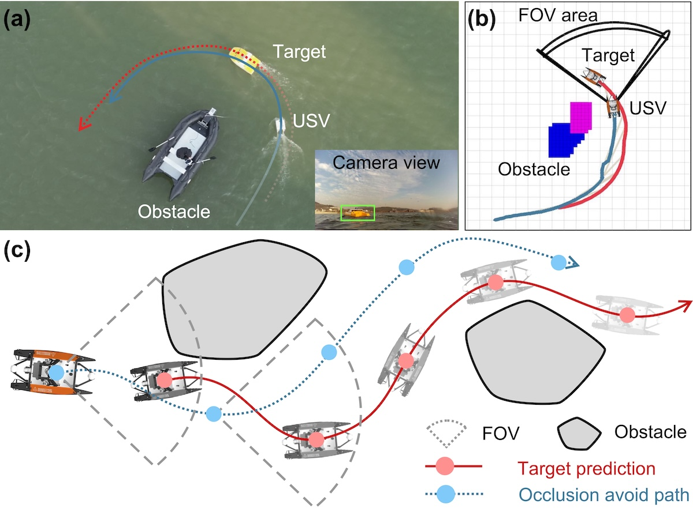

<figure class="publication-figure">
  
  <figcaption>
    <strong>Figure.</strong> USV-Tracker task description. Overview of the USV-Tracker. The blue line represents the 
predicted trajectory of the target, while the red line indicates the planned path of the USV, both incorporating 
strategies for obstacle avoidance and FOV constraints, (a) depicts the actual tracking system in operation blue, (b) 
shows the obstacle map utilized in the path planning task, (c) illustrates a diagram of a USV dynamically tracking a 
moving target, adjusting its course and camera FOV to navigate around obstacles and maintain consistent focus on the 
target.
  </figcaption>
</figure>

<h3 class="publication-section-heading">Abstract</h3>
This paper introduces USV-Tracker, a novel tracking system for Unmanned Surface Vehicles (USVs) tailored for 
practical applications such as surface investigation and target tracking. The system tackles three pivotal 
challenges: perception robustness, tracking concealment, and planning efficiency. The contributions of this work are 
manifold: (1) A multi-sensor fusion framework utilizing an Extended Kalman Filter(EKF) to enhance target detection 
and positioning accuracy, integrating data from cameras, LiDAR, GPS, and IMU sensors. (2) A two-stage path planning 
algorithm that generates occlusion avoidance trajectories and employs a virtual elastic force constraint to maintain 
appropriate relative positioning. In dense obstacle environments, the algorithm tends to get closer to the target 
and incorporates FOV orientation constraints to ensure stable perception. (3) A visibility-aware control strategy 
that ensures continuous target observability through EKF-based trajectory prediction. Simulations in Gazebo and 
corresponding physical experiments validate the system's effectiveness and robustness, demonstrating its 
applicability in real-world scenarios. The computational workload is managed on a constrained on-board computer, 
underscoring the system's practicality.

<h3 class="publication-section-heading">Video</h3>

Physical experimental results.

  <video class="publication-embed publication-embed--video" controls preload="metadata" playsinline>
    <source src="../files/USV_Tracker.mp4" type="video/mp4">
    Your browser does not support embedded video playback.
  </video>

[微信公众号转载文章 (in Chinese)](https://mp.weixin.qq.com/s/Jzc4618i-InVGQvX5f7_DA)

  

    
PDF preview loads only when requested so the page stays responsive.

    <button class="btn btn--inverse lazy-embed__trigger" type="button">Load PDF Preview</button>
    <iframe class="publication-embed publication-embed--pdf lazy-embed__frame" data-src="../files/USV-Tracker.pdf" title="USV-Tracker PDF preview" loading="lazy"></iframe>
  

  <a class="btn btn--inverse" href="../files/USV-Tracker.pdf" target="_blank" rel="noopener">Open PDF</a>
  <a class="btn btn--primary" href="https://drive.google.com/file/d/1G-KOLDakS9qN_-OSj-hvJ7J1RDQqpKeg/preview" target="_blank" rel="noopener">Google Drive</a>

---
