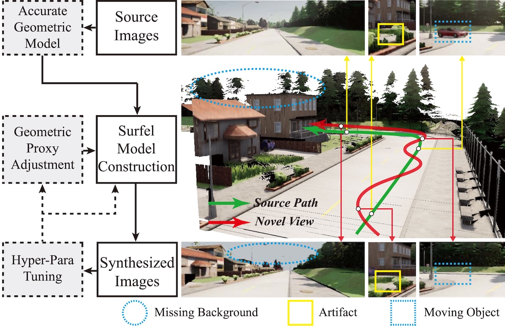

<figure class="content-figure content-figure--narrow">
  
  <figcaption>
    
  </figcaption>
</figure>

<h3 class="publication-section-heading"></h3>

  
Novel view image synthesis for outdoor scenes has been challenged by inaccurate depth measurements, moving objects, and wide-angle rendering. In this paper, we propose an adaptive novel-view image synthesis pipeline to generate realistic images of large-scale traffic scenes. The novelty of this work is threefold: 1) developing a set of high-fidelity 3D surfel-model reconstruction methods with depth refinement and moving-object removal schemes; 2) developing a self-adaptive rendering scheme for different novel views via surfel-geometry adjustment; and 3) developing a hyper-parameter tuning scheme based on image-quality evaluation to achieve better surfel-model construction and adaptation. The removed backgrounds and other occluded regions within 3D scene geometric models are further inpainted using a Generative Adversarial Network (GAN). The KITTI dataset and CARLA simulator are used to verify the proposed pipeline. Experimental results show that our method outperforms other approaches for large-scale traffic-scene image synthesis in terms of computational efficiency and the quality of synthesized images.

  
面向室外场景的新视角图像合成长期受到深度测量不准确、动态物体干扰以及广角渲染失真等问题的影响。本文提出了一种自适应新视角图像合成流程，用于生成大规模交通场景的真实感图像。该工作的创新主要体现在三个方面：1）提出一套高保真三维 surfel 模型重建方法，结合深度优化与动态目标去除策略；2）提出面向不同目标视角的自适应渲染机制，通过调整 surfel 几何属性来适配新视角；3）基于图像质量评估设计超参数调优流程，以提升 surfel 模型构建与自适应效果。对于三维几何模型中因遮挡和动态目标移除而缺失的背景区域，我们进一步使用生成对抗网络（GAN）进行修复。本文在 KITTI 数据集和 CARLA 仿真平台上验证了该流程，实验结果表明，所提方法在大规模交通场景图像合成的计算效率和图像质量上均优于对比方法。

<h3 class="publication-section-heading"></h3>

  <video class="document-embed document-embed--video" controls preload="metadata" playsinline>
    <source src="../files/adaptiveSurfelMapping.mp4" type="video/mp4">
    Your browser does not support embedded video playback.
  </video>

